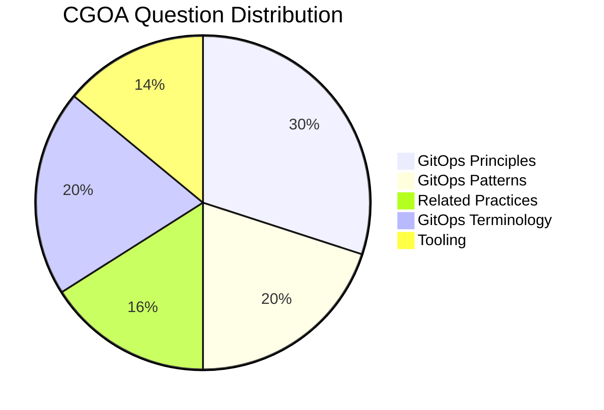

# Certified GitOps Associate (CGOA)

Purpose: The purpose of the Certified GitOps Associate (CGOA) certification is to provide assurance that CGOAs can effectively demonstrate their understanding of GitOps principles, terminology, and best practices in setting up a GitOps managed software system in addition to related practices such as Configuration of Code, Infrastructure as Code, DevOps & DevSecOps, and CI & CD and how to map them to GitOps.

Certification can be found at the [LF Training Portal](https://trainingportal.linuxfoundation.org/courses/certified-gitops-associate-cgoa).

# Facts about CGOA

- Cost 250.00 USD ( Discounts are available through Linux Foundation programs such as [LIFT Scholarship](https://www.linuxfoundation.org/about/lift-scholarships) + KubeCon Attendee Vouchers, and Black Friday Sales.)
- Certification Valid for 3 Years
- Includes 12 Month Exam Eligibility
- One Retake if you didn't PASS
- Multiple Choice Exam ( 60 Questions ) 
- Duration of Exam 90 minutes
- Passing Marks - 75 / Total Marks - 100
- During the exam, you can access Notepad/Calculator in the PSI Secure browser, but it is not required for this exam.
- Exams are scored automatically and barring any exceptions or technical difficulties, a score report will be emailed to you, within 24 hours of completing the exam. 

# Weightage of Different Topics

# Resources in Details 
Following a section-wise approach for the exam helps. You can start from the top and go to the bottom to cover the syllabus: 

## GitOps Terminology

### Continuous
### Declarative Description
### Desired State
### State Drift
### State Reconciliation
### GitOps Managed Software System
### State Store
### Feedback Loop
### Rollback

## GitOps Principles

### Declarative
### Versioned and Immutable
### Pulled Automatically
### Continuously Reconciled

## Related Practices

### Configuration as Code (CaC)
### Infrastructure as Code (IaC)
### DevOps and DevSecOps
### CI and CD

## GitOps Patterns

### Deployment and Release Patterns
### Progressive Delivery Patterns
### Pull vs. Event-driven
### Architecture Patterns (in-cluster and external reconciler, state store management, etc.)

## Tooling
### Manifest Format and Packaging
### State Store Systems (Git and alternatives)
### Reconciliation Engines (ArgoCD, Flux, and alternatives)
### Interoperability with Notifications, Observability, and Continuous Integration Tools

# Study Tips
- Play with the tools like ArgoCD a bit to understand them clearly
- Focus on implementing and running a simple GitOps Application for Clarity
- Learn a bit of Architecture of the Tools as it helps you remember theory for longer

# Exam Tips ( PSI ) 
- Keep your desk tidy and run the System Check before the exams.
-  Carry an ID that has not expired.
- The exam can be started 30 minutes prior to your scheduled time, which is an excellent opportunity to complete the security checks and begin the exam early. It helps me to calm down and not rush during the exam :) 
- Delete the PSI Browser from your system to save time for your next exam. 
- Mark the questions `To Review` if you need more clarification and want to get back later. You have a dashboard with all the questions collectively listed, which helps you to get back to easily
  
# Certificate and a Credly Badge
Once you PASS it, you get the certificate mailed to you ⬇️

With that, you can move on to the next certification from the catalogue. Feel free to contribute any resource, that was helpful to you! 

