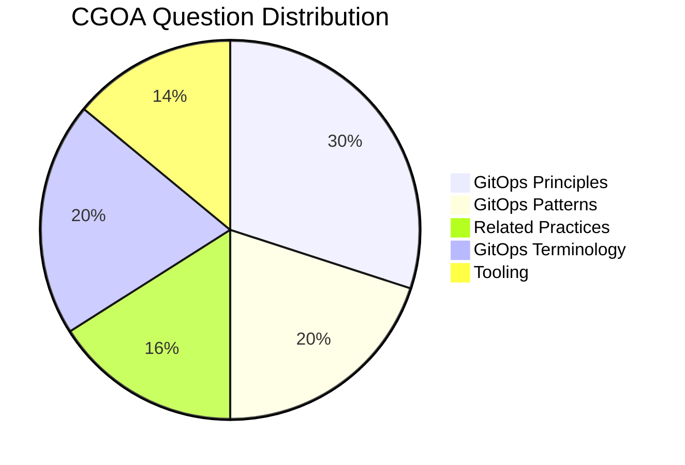

# Certified GitOps Associate (CGOA)

Purpose: The purpose of the Certified GitOps Associate (CGOA) certification is to provide assurance that CGOAs can effectively demonstrate their understanding of GitOps principles, terminology, and best practices in setting up a GitOps managed software system in addition to related practices such as Configuration of Code, Infrastructure as Code, DevOps & DevSecOps, and CI & CD and how to map them to GitOps.

Certification can be found at the [LF Training Portal](https://trainingportal.linuxfoundation.org/courses/certified-gitops-associate-cgoa).

# Facts about CGOA

- Cost - 250.00 USD ( Discounts are available through Linux Foundation programs such as [LIFT Scholarship](https://www.linuxfoundation.org/about/lift-scholarships) + KubeCon Attendee Vouchers, and Black Friday Sales.)
- Certification Valid for 3 Years
- Includes 12 Month Exam Eligibility
- One Retake if you didn't PASS
- Multiple Choice Exam ( 60 Questions ) 
- Duration of Exam 90 minutes
- Passing Marks - 75 / Total Marks - 100 or 45/60 Questions should be correct
- During the exam, you can access Notepad/Calculator in the PSI Secure browser, but it is not required for this exam.
- Exams are scored automatically and barring any exceptions or technical difficulties, a score report will be emailed to you, within 24 hours of completing the exam. 

# Weightage of Different Topics

# Resources in Details 
Following a section-wise approach for the exam helps. You can start from the top and go to the bottom to cover the syllabus: 

## GitOps Terminology

### Continuous
- **Description**: The reconciliation process is continuous and ongoing, rather than happening instantaneously.
- **Why it Matters**: Continuous reconciliation ensures that your system remains in the desired state consistently, even as changes occur over time.

### Declarative Description
- **Definition**: Defines what the desired state of the cluster should be, without specifying the exact steps or procedures for achieving that state.
- **Why it Matters**: By focusing on the desired outcome rather than implementation details, declarative descriptions provide clarity and flexibility in managing system configurations.

### Desired State
- **Description**: The final configuration or state that you want your system to achieve.
- **Why it Matters**: Understanding and defining the desired state is crucial for ensuring that your system operates as intended.

### State Drift
- **Description**: Refers to the inconsistency or variance between the desired state and the actual current state of the system.
- **Why it Matters**: Identifying and addressing state drift helps maintain system reliability and consistency.

### State Reconciliation
- **Description**: The process of aligning the actual system state with the desired state, effectively eliminating any drift.
- **Why it Matters**: Reconciliation ensures that your system remains consistent and operational according to the defined configuration.

### GitOps Managed Software System
- **Definition**: Software systems that are managed according to GitOps principles.
- **Why it Matters**: Leveraging GitOps principles ensures reliability, scalability, and consistency in managing software deployments and configurations.

### State Store
- **Description**: The centralized repository that serves as the single source of truth for your cluster's configuration and desired state.
- **Why it Matters**: A centralized state store simplifies management and ensures consistency across environments.

### Feedback Loop
- **Description**: The process of gathering and incorporating feedback from various sources before executing the reconciliation process.
- **Why it Matters**: Incorporating feedback helps identify potential issues or conflicts and ensures smoother reconciliation processes.

### Rollback
- **Methods**:
  - `git revert`: Using Git's revert functionality to undo changes made to the configuration.
  - Automatic rollback: Tools like ArgoCD can automatically revert to a previous known state in case of failures.
- **Why it Matters**: Rollback mechanisms provide a safety net, allowing you to quickly recover from errors or failures during the reconciliation process.

## GitOps Principles ( Inspired From [GitOps Principles](https://github.com/open-gitops/documents/blob/main/PRINCIPLES.md) )

### Declarative
- **Description**: Your system's configuration and desired state should be clearly expressed in a declarative manner.
- **Why it Matters**: This makes it easier to understand and manage what your system should look like without needing to know the intricacies of how to achieve that state.

### Versioned and Immutable
- **Description**: Your system's desired state should be stored in a way that ensures it remains unchanged (immutable) and maintains a complete history of changes (versioned).
- **Why it Matters**: By preserving a history of changes, you can track and understand the evolution of your system over time, while immutability ensures consistency and reliability.

### Pulled Automatically
- **Description**: Agents or tools automatically retrieve and apply the desired state from a specified source (usually a Git repository).
- **Why it Matters**: Automation simplifies the process of updating and maintaining your system, reducing the risk of human error and ensuring consistency across environments.

### Continuously Reconciled
- **Description**: Agents or tools constantly monitor the actual state of the system and compare it against the desired state. Any deviations are automatically corrected.
- **Why it Matters**: This ensures that your system remains in the desired state at all times, even as changes occur, leading to increased reliability and stability.

## Related Practices

### Configuration as Code (CaC)
- **Ansible**: Ansible is a configuration management tool that automates software provisioning, configuration management, and application deployment.
- **CaC in DevOps Pipeline**: Configuration as Code is integral to DevOps pipelines as it allows for consistent and repeatable infrastructure and application configurations across different environments.

### Infrastructure as Code (IaC)
- **Terraform/OpenTofu**: Terraform and OpenTofu are infrastructure as code (IaC) tools used to provision and manage infrastructure resources.
- **IaC in a DevOps Pipeline**: Infrastructure as Code is a key practice in DevOps pipelines as it enables infrastructure to be versioned, automated, and treated as code, facilitating collaboration and consistency.
- **State locking**: State locking ensures that only one process or user can modify the infrastructure state at a time, preventing conflicts and ensuring consistency.
- **IaC vs CaC**: While both practices involve managing infrastructure through code, Infrastructure as Code focuses on provisioning and managing infrastructure resources, while Configuration as Code focuses on application and configuration management.

### DevOps and DevSecOps
- **How DevSecOps is implemented in GitOps (Security Policies)**: DevSecOps integrates security practices into the DevOps process, including security policies as code, vulnerability scanning, and automated compliance checks, ensuring security is built into the software delivery lifecycle.
- **DevSecOps and its importance**: DevSecOps emphasizes collaboration between development, operations, and security teams to integrate security into every stage of the software development lifecycle, reducing risk and accelerating delivery.

### CI and CD
- **CD vs GitOps (GitOps has Reconciliation with a state store)**: Continuous Delivery (CD) focuses on automating the process of delivering software to production, while GitOps extends this by using Git as the single source of truth for declarative infrastructure and application configuration, with automated reconciliation ensuring desired state.
- **CI in GitOps Process (CI comes before GitOps, which is a delivery pattern)**: Continuous Integration (CI) involves automatically building and testing code changes, which is typically done before GitOps processes take over for deployment and management, ensuring that changes are thoroughly tested before being applied to the production environment.
## GitOps Patterns

### Deployment and Release Patterns
- **Rolling Update**: Updates are applied gradually across instances, ensuring minimal disruption to the application.
- **Recreate**: Instances are replaced entirely with the new version, suitable for environments where state persistence is not a concern.
- **Blue/Green**:
  - **Traffic Handling**: In Blue/Green deployment, traffic is switched between two identical environments (blue and green), with one serving live traffic while the other is updated.
  - **Resource Reconciliation**: Resources are managed in separate environments, and reconciliation involves switching traffic and updating resources accordingly.

### Progressive Delivery Patterns
- **Goals of the Model**: Progressive delivery aims to reduce risk and improve feedback loops by gradually exposing changes to a subset of users.
- **Canary**: Canary releases involve rolling out changes to a small subset of users or servers before making them available to the wider audience.

### Pull vs. Event-driven
- **Difference between Pull and Event-Driven**: Pull-based GitOps involves agents periodically pulling desired state from a Git repository, while event-driven GitOps responds to changes triggered by events such as Git commits or CI/CD pipeline runs.
- **Relationship and Pattern Similarity**: Both pull and event-driven approaches aim to ensure that the actual state matches the desired state, albeit through different mechanisms, and can be complementary depending on the use case and infrastructure requirements.

### Architecture Patterns (in-cluster and external reconciler, state store management, etc.)
- **Reconciler Types**: In-cluster reconcilers run within the Kubernetes cluster and manage resources directly, while external reconcilers operate outside the cluster and interact with Kubernetes API to reconcile state.
- **State Store Management**: State store management is crucial in GitOps to store and version control the desired state of the system, ensuring consistency and traceability.
- **Secret Management in GitOps**: Tools like [Sealed Secrets](https://loft.sh/blog/gitops-kubernetes-managing-kubernetes-secrets/), Vault, and others are used to manage sensitive information such as Kubernetes secrets in GitOps workflows, ensuring secure storage and distribution.

## Tooling

### Manifest Format and Packaging
- [Helm](https://helm.sh/), [Kustomize](https://kustomize.io/) and how the manifests are structured
- File Structure with different packing tools
- Using normal Kubernetes manifest for Packaging 

### State Store Systems (Git and alternatives)
- **Storage Buckets**: Storage buckets, such as those provided by cloud providers like AWS S3 or Google Cloud Storage, can be used as a state store for GitOps. These buckets store versioned copies of Kubernetes manifests, providing a reliable source of truth for the desired state.
- **Git**: Git is commonly used as a state store in GitOps workflows. Git repositories store declarative configuration files (manifests) in version control, enabling collaboration, change tracking, and auditability.

### Reconciliation Engines (ArgoCD, Flux, and alternatives)
- **ArgoCD**: ArgoCD is a declarative, GitOps continuous delivery tool for Kubernetes. It continuously monitors Git repositories for changes to application manifests and automatically deploys them to the cluster.
- **Flux**: Flux is a Kubernetes operator that automates the deployment and lifecycle management of applications. It pulls manifests from Git repositories and reconciles them with the cluster's state.
- **JenkinsX**: JenkinsX is an open-source tool for automated CI/CD with Kubernetes. While primarily known for CI/CD, JenkinsX also supports GitOps workflows, providing features for declarative deployments and managing Kubernetes configurations.
- How they operate ( Push/Pull Model + Internal/External Reconciliation)

### Interoperability with Notifications, Observability, and Continuous Integration Tools
- Prometheus and [Alertmanager](https://prometheus.io/docs/alerting/latest/alertmanager/) with how notification is handled to different messaging platforms
- A Feedback loop in Reconciliation approved by notification
- [DORA](https://cloud.google.com/blog/products/devops-sre/using-the-four-keys-to-measure-your-devops-performance) Metrics
  
# Extra Resources:
- [GitOps Glossary](https://github.com/open-gitops/documents/blob/main/GLOSSARY.md#software-system)
- [Introduction to GitOps (LFS169)](https://training.linuxfoundation.org/training/introduction-to-gitops-lfs169/)
- [Learn Argo CD](https://codefresh.io/learn/argo-cd/)

# Study Tips
- Play with the tools like ArgoCD a bit to understand them clearly
- Focus on implementing and running a simple GitOps Application for Clarity
- Learn a bit of Architecture of the Tools as it helps you remember theory for longer

# Exam Tips ( PSI ) 
- Keep your desk tidy and run the System Check before the exams.
-  Carry an ID that has not expired.
- The exam can be started 30 minutes prior to your scheduled time, which is an excellent opportunity to complete the security checks and begin the exam early. It helps me to calm down and not rush during the exam :) 
- Delete the PSI Browser from your system to save time for your next exam. 
- Mark the questions `To Review` if you need more clarification and want to get back later. You have a dashboard with all the questions collectively listed, which helps you to get back to easily
  
# Certificate and a Credly Badge
Once you PASS it, you get the certificate mailed to you ⬇️

With that, you can move on to the next certification from the catalogue. Feel free to contribute any resource, that was helpful to you! 

