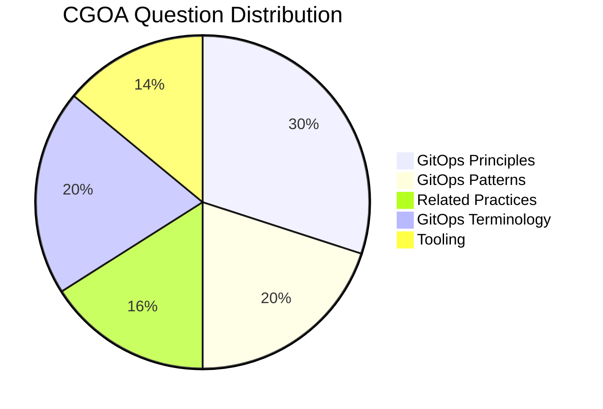

# Certified GitOps Associate (CGOA)

Purpose: The purpose of the Certified GitOps Associate (CGOA) certification is to provide assurance that CGOAs can effectively demonstrate their understanding of GitOps principles, terminology, and best practices in setting up a GitOps managed software system in addition to related practices such as Configuration of Code, Infrastructure as Code, DevOps & DevSecOps, and CI & CD and how to map them to GitOps.

Certification can be found at the [LF Training Portal](https://trainingportal.linuxfoundation.org/courses/certified-gitops-associate-cgoa).

# Facts about CGOA

- Cost - 250.00 USD ( Discounts are available through Linux Foundation programs such as [LIFT Scholarship](https://www.linuxfoundation.org/about/lift-scholarships) + KubeCon Attendee Vouchers, and Black Friday Sales.)
- Certification Valid for 3 Years
- Includes 12 Month Exam Eligibility
- One Retake if you didn't PASS
- Multiple Choice Exam ( 60 Questions ) 
- Duration of Exam 90 minutes
- Passing Marks - 75 / Total Marks - 100 or 45/60 Questions should be correct
- During the exam, you can access Notepad/Calculator in the PSI Secure browser, but it is not required for this exam.
- Exams are scored automatically and barring any exceptions or technical difficulties, a score report will be emailed to you, within 24 hours of completing the exam. 

# Weightage of Different Topics

# Resources in Details 
Following a section-wise approach for the exam helps. You can start from the top and go to the bottom to cover the syllabus: 

## GitOps Terminology

### Continuous
- Continuously and not instantaneously Reconciled

### Declarative Description
- Defining the what and not how on the Cluster State

### Desired State
- Your Final State
  
### State Drift
- Drift between the desired State and the current state

### State Reconciliation
- Removing the Drift to match the states

### GitOps Managed Software System
- Software that's managed using [GitOps Principles](https://github.com/open-gitops/documents/blob/main/PRINCIPLES.md)
  
### State Store
- Single Source of Truth for your Cluster. State here is created by Manfiest
  
### Feedback Loop
- Why is the feedback loop important before Reconciliation

### Rollback
- git revert
- Rolling back automatically to previous state in case of failure
- How to do that in tools like ArgoCD 

## GitOps Principles
The [Charter](https://github.com/open-gitops/documents/blob/main/PRINCIPLES.md) has all the Principles defined.
### Declarative
### Versioned and Immutable
### Pulled Automatically
### Continuously Reconciled

## Related Practices

### Configuration as Code (CaC)
- Ansible what's it
- CaC in DevOps Pipeline
### Infrastructure as Code (IaC)
- Terraform/OpenTofu what they're
- IaC in a DevOps Pipeline
- State locking
- IaC vs CaC
### DevOps and DevSecOps
- How DevSecOps is implemented in GitOps ( Security Policies ) 
- DevSecOps and its importance
### CI and CD
- CD vs GitOps ( GitOps has Reconciliation with a state store )
- CI in GitOps Process ( CI comes before GitOps, which is a delivery pattern )

## GitOps Patterns

### Deployment and Release Patterns
- Rolling Update
- Recreate
- Blue/Green
  - how traffic is handled
  - how resources are reconciled 

### Progressive Delivery Patterns
- Goals of the Model
- Canary

### Pull vs. Event-driven
- Difference b/w Pull and Event Driven
- How both of them relate to each other and pattern similarity 

### Architecture Patterns (in-cluster and external reconciler, state store management, etc.)
- Reconciler Types: in-cluster and external reconciler
- State Store Management: Why it's required/What it solves
- Secret Management in GitOps: [Sealed Secrets](https://loft.sh/blog/gitops-kubernetes-managing-kubernetes-secrets/), Vault and others

## Tooling

### Manifest Format and Packaging
- [Helm](https://helm.sh/), [Kustomize](https://kustomize.io/) and how the manifests are structured
- File Structure with different packing tools
- Using normal Kubernetes manifest for Packaging 

### State Store Systems (Git and alternatives)
- Storage Buckets, Git

### Reconciliation Engines (ArgoCD, Flux, and alternatives)
- ArgoCD, Argo Workflows, Flux, JenkinsX and how they operate ( Push/Pull Model + Internal/External Reconciliation)
  
### Interoperability with Notifications, Observability, and Continuous Integration Tools
- Prometheus and [Alertmanager](https://prometheus.io/docs/alerting/latest/alertmanager/) with how notification is handled to different messaging platforms
- Feedback loop in Reconciliation approved by notification
- [DORA](https://cloud.google.com/blog/products/devops-sre/using-the-four-keys-to-measure-your-devops-performance) Metrics

# Study Tips
- Play with the tools like ArgoCD a bit to understand them clearly
- Focus on implementing and running a simple GitOps Application for Clarity
- Learn a bit of Architecture of the Tools as it helps you remember theory for longer

# Exam Tips ( PSI ) 
- Keep your desk tidy and run the System Check before the exams.
-  Carry an ID that has not expired.
- The exam can be started 30 minutes prior to your scheduled time, which is an excellent opportunity to complete the security checks and begin the exam early. It helps me to calm down and not rush during the exam :) 
- Delete the PSI Browser from your system to save time for your next exam. 
- Mark the questions `To Review` if you need more clarification and want to get back later. You have a dashboard with all the questions collectively listed, which helps you to get back to easily
  
# Certificate and a Credly Badge
Once you PASS it, you get the certificate mailed to you ⬇️

With that, you can move on to the next certification from the catalogue. Feel free to contribute any resource, that was helpful to you! 

